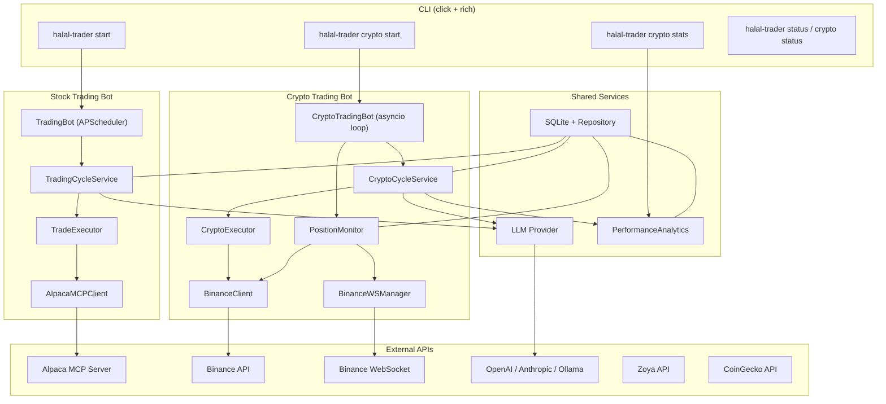
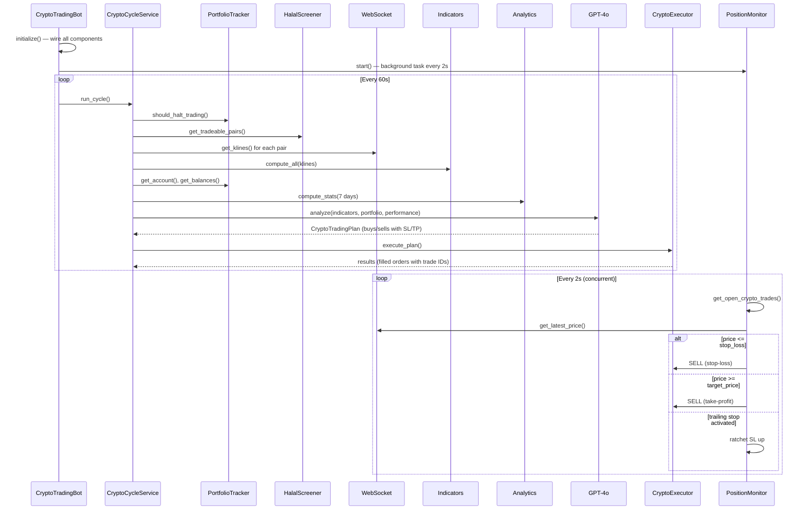
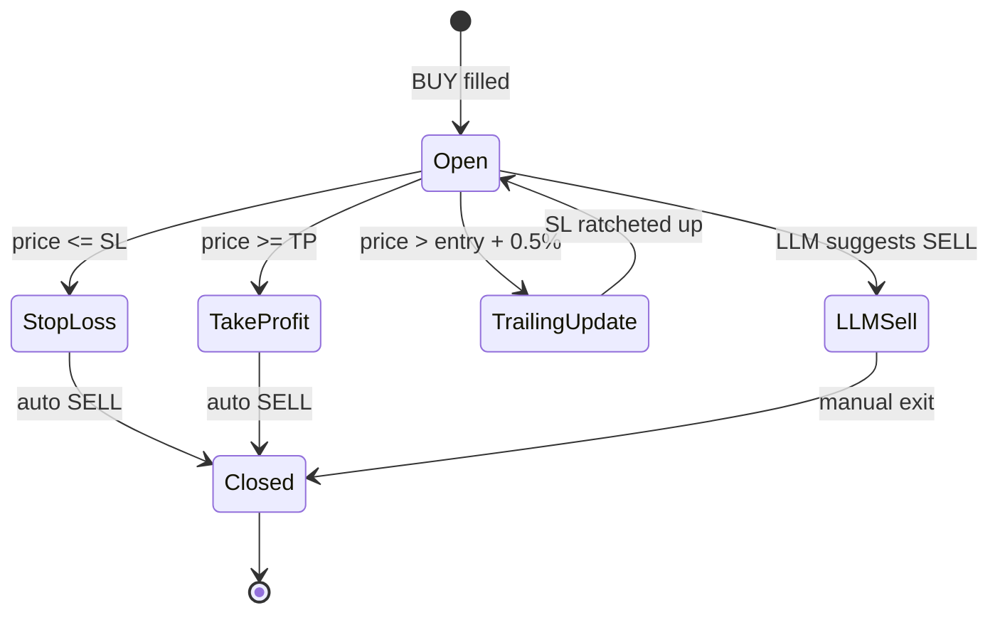
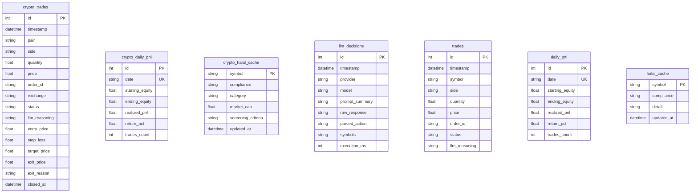

# Halal Trader — Architecture

LLM-powered trading bot for halal-compliant stocks (Alpaca) and crypto (Binance).

---

## System Overview



---

## Project Structure

```
src/halal_trader/
├── cli.py                    # Click CLI entry point
├── config.py                 # Pydantic Settings (.env)
├── logging.py                # Dual-output: Rich console + JSON log files
├── market_hours.py           # NYSE/NASDAQ hours, holidays, timezone helpers
│
├── domain/
│   ├── models.py             # Pydantic value objects (Account, Kline, TradingPlan, ...)
│   └── ports.py              # Protocols: Broker, LLMProvider, ComplianceScreener, ...
│
├── db/
│   ├── models.py             # SQLModel tables + init_db()
│   └── repository.py         # Async CRUD for trades, P&L, halal cache, decisions
│
├── agent/
│   ├── llm.py                # LLM abstraction: Ollama, OpenAI, Anthropic
│   ├── strategy.py           # Stock LLM strategy (prompts + TradingPlan)
│   └── sentiment.py          # FinGPT/FinBERT sentiment analysis (optional)
│
├── halal/
│   ├── zoya.py               # Zoya GraphQL API for stock Shariah screening
│   └── cache.py              # Stock halal cache with 24h TTL
│
├── mcp/
│   └── client.py             # Alpaca MCP client (stdio transport)
│
├── trading/                  # ── Stock trading ──
│   ├── scheduler.py          # APScheduler cron jobs (pre-market, intraday, EOD)
│   ├── cycle.py              # Single intraday cycle (gather, analyze, execute)
│   ├── executor.py           # Order placement via Alpaca MCP
│   └── portfolio.py          # Daily equity tracking, loss limit
│
└── crypto/                   # ── Crypto trading ──
    ├── scheduler.py          # 24/7 asyncio loop (composition root)
    ├── cycle.py              # Single crypto cycle (gather, analyze, execute)
    ├── strategy.py           # Crypto LLM strategy (1-minute scalping prompts)
    ├── executor.py           # Binance order execution with pre-validation
    ├── exchange.py           # Binance async REST client
    ├── websocket.py          # Real-time 1m kline streams (rolling buffer)
    ├── monitor.py            # Live SL/TP enforcement + trailing stops
    ├── analytics.py          # Win rate, profit factor, drawdown, per-pair stats
    ├── indicators.py         # RSI, MACD, Bollinger, EMA, ATR, VWAP, volume
    ├── portfolio.py          # Crypto P&L tracking, daily loss limit
    └── screener.py           # CoinGecko-based halal screening
```

---

## Crypto Trading Pipeline

The crypto bot runs 24/7 with a configurable cycle interval (default: 60 seconds).



### What the LLM Receives

Each cycle, the LLM prompt includes:

| Section | Content |
|---------|---------|
| **Portfolio Status** | Total balance, available USDT, max position size, today's P&L |
| **Current Positions** | Balances for configured trading pairs only |
| **Halal Pairs** | Filtered list of tradeable pairs |
| **Technical Indicators** | Per-pair: price changes, RSI(14), MACD(12/26/9), Bollinger(20,2), EMA(9/21/50), ATR(14), VWAP, volume ratio |
| **Order Book** | Best bid/ask, spread, imbalance direction |
| **Recent Performance** | Win rate, avg win/loss, profit factor, drawdown, best/worst pair, streak |

### What the LLM Returns

```json
{
  "decisions": [
    {
      "action": "buy",
      "symbol": "BTCUSDT",
      "quantity": 0.05,
      "confidence": 0.85,
      "reasoning": "RSI at 35 with bullish MACD crossover...",
      "entry_price": 68300.0,
      "target_price": 69000.0,
      "stop_loss": 67800.0
    }
  ],
  "market_outlook": "Bullish momentum across major pairs...",
  "risk_notes": "Volume is low on ETH..."
}
```

---

## Stock Trading Pipeline

The stock bot uses APScheduler with cron triggers aligned to NYSE market hours.

| Job | Schedule (ET) | Action |
|-----|---------------|--------|
| Pre-market | 09:00 Mon-Fri | Refresh halal cache, record starting equity |
| Trading cycle | 09:30-15:45, every N min | Gather data, LLM analysis, execute |
| End of day | 15:50 | Close all positions, record P&L |
| Early-close EOD | 12:50 | Same as EOD but only on half-days |

Uses the Alpaca MCP server (spawned as subprocess via stdio transport) for all broker operations.

---

## Position Monitor (SL/TP Enforcement)

Runs as a background async task alongside the trading cycle.



- Checks open positions every 2 seconds using WebSocket prices
- Trailing stop: activates at +0.5% from entry, maintains 0.3% distance from high water mark
- Records `exit_reason` (stop_loss, take_profit, llm_sell) for analytics

---

## Database Schema



---

## Halal Compliance Screening

### Stocks (Zoya API)

- Queries Zoya GraphQL for `basicCompliance.report`
- Maps `COMPLIANT` / `NON_COMPLIANT` / `DOUBTFUL`
- Falls back to 20 AAOIFI-approved large-cap defaults when Zoya is unavailable
- Cache refreshed daily (24h TTL in `halal_cache` table)

### Crypto (CoinGecko + Rules)

Screening criteria inspired by Mufti Faraz Adam's framework:

1. **Category filter** — rejects gambling, adult, lending, interest-bearing, ponzi categories
2. **Token type** — rejects meme, rebase, leveraged, gambling, NSFW tags
3. **Legitimacy** — minimum market cap (default $1B)
4. **Halal overrides** — BTC, ETH, ADA, SOL, and other infrastructure tokens always allowed
5. **Deny overrides** — configurable blocklist

Cache refreshed daily in `crypto_halal_cache` table.

---

## LLM Providers

| Provider | Class | JSON Mode | Notes |
|----------|-------|-----------|-------|
| Ollama | `OllamaLLM` | `format="json"` | Local, default `qwen2.5:32b` |
| OpenAI | `OpenAILLM` | `response_format=json_object` | GPT-4o, temp 0.2 |
| Anthropic | `AnthropicLLM` | Prompt-based | Claude, `max_tokens=4096` |

Factory function `create_llm(settings)` selects the provider based on `LLM_PROVIDER` env var.

---

## Performance Analytics

Computes rolling metrics from closed round-trip trades:

| Metric | Description |
|--------|-------------|
| Win Rate | % of trades with positive P&L |
| Avg Win / Avg Loss | Mean return % for winners and losers |
| Profit Factor | Gross wins / gross losses |
| Max Drawdown | Largest peak-to-trough on cumulative P&L |
| Best / Worst Pair | Symbol with highest / lowest total P&L |
| Avg Hold Time | Mean trade duration in minutes |
| Current Streak | Consecutive wins or losses |
| Exit Reasons | Breakdown by stop_loss, take_profit, llm_sell |

These stats are injected into the LLM prompt each cycle so the model can adapt its strategy based on its own track record.

---

## CLI Commands

```
halal-trader [--log-level LEVEL]
├── start [--once]              # Run stock trading bot
├── status                      # Show stock portfolio and market clock
├── history [--limit N]         # Show stock trade history and daily P&L
├── config                      # Show current configuration
└── crypto
    ├── start [--once]          # Run crypto trading bot (24/7)
    ├── status                  # Show Binance account and balances
    ├── history [--limit N]     # Show crypto trade history and daily P&L
    ├── stats [--days N]        # Show performance metrics and round-trips
    └── screen                  # Refresh and show halal crypto pairs
```

---

## Configuration

All settings are loaded from environment variables or `.env` file via Pydantic Settings.

Key environment variables:

```bash
# LLM
LLM_PROVIDER=openai              # ollama | openai | anthropic
LLM_MODEL=gpt-4o
OPENAI_API_KEY=sk-...

# Binance (crypto)
BINANCE_API_KEY=...
BINANCE_SECRET_KEY=...
BINANCE_TESTNET=true

# Alpaca (stocks)
ALPACA_API_KEY=...
ALPACA_SECRET_KEY=...
ALPACA_PAPER_TRADE=true

# Trading parameters
CRYPTO_TRADING_INTERVAL_SECONDS=60
CRYPTO_DAILY_RETURN_TARGET=0.01
CRYPTO_MAX_POSITION_PCT=0.25
CRYPTO_DAILY_LOSS_LIMIT=0.03
```

---

## Dependencies

- **Runtime**: Python 3.14+, SQLite
- **Core**: `mcp`, `ollama`, `httpx`, `pydantic-settings`, `click`, `rich`
- **Data**: `sqlmodel`, `aiosqlite`, `alembic`
- **Trading**: `python-binance`, `numpy`, `apscheduler`
- **LLM**: `openai`, `anthropic`
- **Optional**: `transformers`, `peft`, `torch` (for FinGPT sentiment)
