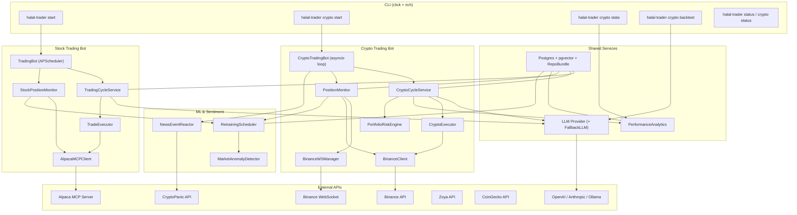
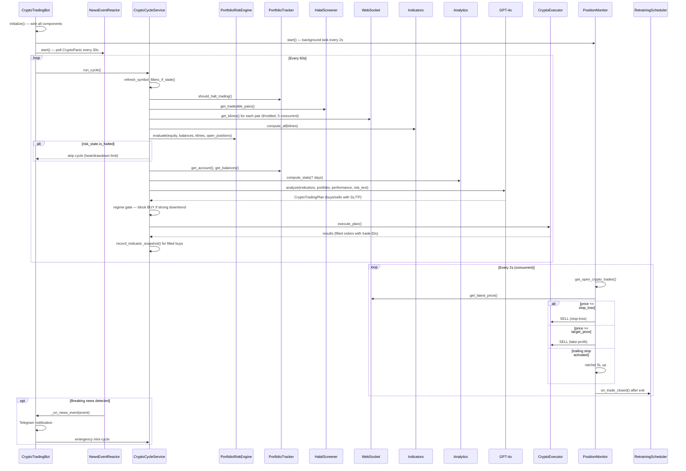
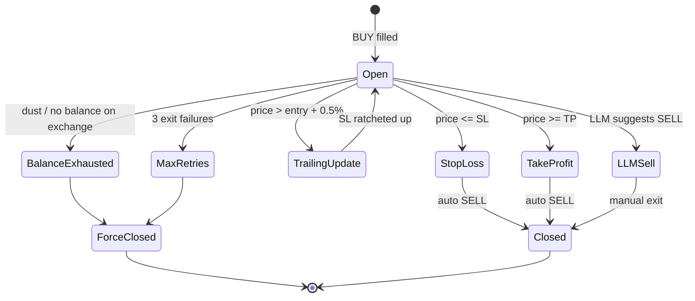
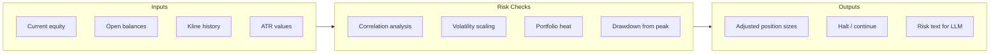
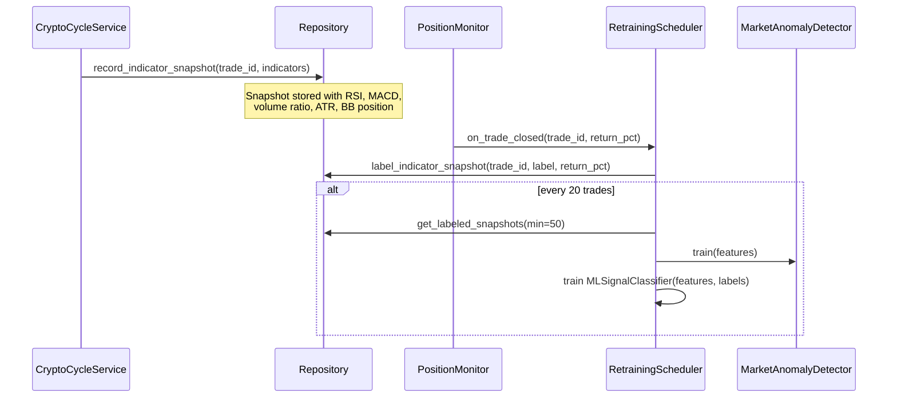

# Halal Trader — Architecture

LLM-powered trading bot for halal-compliant stocks (Alpaca) and crypto (Binance).

---

## System Overview



---

## Project Structure

```
src/halal_trader/
├── cli.py                    # Click CLI entry point
├── config.py                 # Pydantic Settings (.env)
├── logging.py                # Dual-output: Rich console + JSON log files
├── market_hours.py           # NYSE/NASDAQ hours, holidays, timezone helpers
│
├── domain/
│   ├── models.py             # Pydantic value objects (Account, Kline, TradingPlan, ...)
│   └── ports.py              # Protocols: Broker, LLMProvider, ComplianceScreener, ...
│
├── db/
│   ├── models.py             # SQLModel tables + init_db()
│   ├── repository.py         # Legacy facade — thin delegators over RepoBundle
│   └── repos/                # Per-table mini-repos (Wave D)
│       ├── protocols.py      # 15 narrow Protocols (TradeRepo, …)
│       ├── trades.py / crypto_trades.py
│       ├── pnl.py / stock_pnl.py
│       ├── halal_cache.py / stock_halal_cache.py / halal_screening.py
│       ├── runtime_config.py / pair_pause.py / web_audit.py
│       ├── purification.py / strategy_adjustments.py
│       ├── indicator_snapshots.py / llm_decisions.py / research_jobs.py
│       └── __init__.py        # RepoBundle.from_engine(engine)
│
├── core/                     # Cross-asset shared services
│   ├── llm/                  # LLM abstraction (Ollama / OpenAI / Anthropic),
│   │                         # ensemble + adversarial + agentic tool-use,
│   │                         # Platt calibration, RAG over rationales,
│   │                         # prompt registry + evolution GA
│   ├── cycle.py              # Base cycle service (shared lifecycle)
│   ├── cycle_pipeline.py     # CycleState dataclass + run_stages driver
│   ├── cycle_stages.py       # 18 stage classes (BuildXStage / Augment*Stage / ApplyRegimeGateStage)
│   ├── event_bus.py          # In-process pub/sub (live-cycle WebSocket)
│   ├── insights_hub.py       # Shadow ledger / regime memory / RAG / etc.
│   ├── post_close.py         # Close-event fan-out (drift / thesis / regret / RAG / purification)
│   ├── shadow_runner.py      # Frozen-prompt parallel strategy
│   ├── supervisor.py         # anyio task supervisor (structured concurrency)
│   ├── tracing.py            # OpenTelemetry spans
│   └── reconcile.py          # Daily DB↔broker drift check
│
├── halal/
│   ├── zoya.py               # Zoya GraphQL API for stock Shariah screening
│   └── cache.py              # Stock halal cache with 24h TTL
│
├── mcp/
│   └── client.py             # Alpaca MCP client (stdio transport)
│
├── trading/                  # ── Stock trading ──
│   ├── scheduler.py          # APScheduler cron jobs (pre-market, intraday, EOD)
│   ├── cycle.py              # Single intraday cycle (gather, analyze, execute)
│   ├── strategy.py           # Stock LLM strategy (prompts + TradingPlan)
│   ├── executor.py           # Order placement via Alpaca MCP
│   ├── monitor.py            # Intra-cycle SL/TP enforcement + trailing stops
│   ├── portfolio.py          # Daily equity tracking, loss limit
│   ├── risk.py               # Stock portfolio-risk adapter (uses crypto.risk engine)
│   ├── bars.py               # Alpaca bars → Kline coercion + indicator helper
│   ├── timeframes.py         # Multi-timeframe analyzer (1Hour/1Day/1Week)
│   ├── snapshots.py          # Indicator-snapshot recorder for ML labelling
│   ├── catalysts.py          # News/earnings/insider catalyst feed
│   ├── fred_catalysts.py     # Macro release calendar (CPI/FOMC/NFP/GDP)
│   ├── edgar_catalysts.py    # SEC 8-K material-event stream
│   ├── fed_speak.py          # Federal Reserve speeches scraper
│   ├── options_iv.py         # Options IV-skew catalyst
│   └── backtest.py           # Stock backtester
│
├── sentiment/
│   ├── manager.py            # Orchestrates Reddit + CryptoPanic on a schedule
│   ├── cryptopanic.py        # CryptoPanic v2 collector (exponential backoff)
│   ├── reddit.py             # PRAW-based Reddit collector (when keys configured)
│   ├── reddit_public.py      # OAuth-free public-JSON fallback for mention velocity
│   ├── velocity.py           # Mention rate-of-change + novelty scoring
│   ├── scoring.py            # Composite sentiment signals
│   ├── feed.py               # Shared types
│   └── events.py             # News reactor (high-impact → emergency mini-cycle)
│
├── ml/
│   ├── anomaly.py            # IsolationForest anomaly detector + signal classifier
│   ├── retrainer.py          # Automated retraining on labeled snapshots
│   ├── forecaster.py         # Chronos-T5 price forecaster (optional [ml] extra)
│   ├── calibration.py        # Platt + isotonic LLM-confidence calibrator
│   ├── drift.py              # Online concept-drift monitor
│   ├── slippage.py           # Replay-fitted slippage regression
│   └── regime_memory.py      # Embedding-based regime memory (pgvector)
│
└── crypto/                   # ── Crypto trading ──
    ├── scheduler.py          # 24/7 asyncio loop (composition root)
    ├── cycle.py              # Single crypto cycle (gather, analyze, execute)
    ├── strategy.py           # Crypto LLM strategy (configurable SL/TP, sell-only mode)
    ├── executor.py           # Binance order execution with pre-validation
    ├── exchange.py           # Binance async REST client (periodic filter refresh)
    ├── websocket.py          # Real-time 1m kline streams (rolling buffer)
    ├── monitor.py            # Live SL/TP enforcement + trailing stops + exit retries
    ├── risk.py               # Portfolio-level risk engine (correlation, heat, drawdown)
    ├── analytics.py          # Win rate, profit factor, drawdown, per-pair stats
    ├── backtest.py           # Backtest engine (rule-based + LLM mode with caching)
    ├── indicators.py         # RSI, MACD, Bollinger, EMA, ATR, VWAP, volume
    ├── portfolio.py          # Crypto P&L tracking, daily loss limit
    ├── self_improve.py       # LLM self-review: tunes position size, SL, and TP
    └── screener.py           # CoinGecko-based halal screening
```

---

## Crypto Trading Pipeline

The crypto bot runs 24/7 with a configurable cycle interval (default: 60 seconds). Each cycle is wrapped in `asyncio.wait_for` with a timeout of `interval * 2` to prevent stuck cycles from blocking the bot.



### What the LLM Receives

Each cycle, the LLM prompt is built from the helpers under
`crypto/cycle.py:_build_*_text` plus shared cross-asset helpers in
`crypto.regime`, `ml.anomaly`, and `crypto.timeframes`.

| Section | Content |
|---------|---------|
| **Portfolio Status** | Total balance, available USDT, max position size, today's P&L |
| **Open Positions** | Count vs max, with sell-only mode warning at capacity |
| **Current Positions** | Balances for configured trading pairs only |
| **Halal Pairs** | Filtered list of tradeable pairs |
| **Technical Indicators** | Per-pair: price changes, RSI(14), MACD(12/26/9), Bollinger(20,2), EMA(9/21/50), ATR(14), VWAP, volume ratio |
| **Order Book / Microstructure** | Best bid/ask, spread, imbalance direction; depth + orderbook stats |
| **Recent Performance** | Win rate, avg win/loss, profit factor, drawdown, best/worst pair, streak |
| **Portfolio Risk** | Avg correlation, portfolio heat %, drawdown %, risk-adjusted position limits per symbol |
| **Sentiment** | CryptoPanic news scores + Reddit mention buzz, plus a "mention velocity" surge block from `RedditPublicFetcher` |
| **Multi-timeframe** | 5m / 15m / 1h / 4h / 1d trend-alignment score per pair via `TimeframeAnalyzer` |
| **Regime** | `RegimeDetector` per-pair classification (trending up/down, ranging, high-vol) with tactical instructions |
| **ML signals** | IsolationForest anomalies, signal-classifier confidence, and Chronos-T5 price forecasts |
| **News reactor** | Recent high-impact events from CryptoPanic that haven't yet triggered a mini-cycle |
| **Whale flows** | On-chain ERC-20 transfer signals from Etherscan (when keyed) |
| **Spot-perp basis** | Funding-rate / basis spread (`BasisTracker`) |
| **RAG hits** | Top-k analogous past-trade rationales pulled from `DBRationaleStore` (pgvector) |
| **Catalyst calendar** | Macro-release windows (CPI / FOMC / NFP / GDP) — only when a release is imminent |
| **Active adjustments** | Self-improvement knob overrides currently in effect (`max_position_pct`, `stop_loss_pct`, etc.) |
| **Exchange rules** | Min-notional, lot-size, and tick-size constraints from Binance's exchangeInfo |

The prompt also includes dynamic guidance for position sizing (min $50 notional, confidence-based scaling) and configurable SL/TP percentages. When open positions reach the max, the strategy switches to **sell-only mode**, forbidding new buys. Optional layers on top: ensemble fan-out (median quantity / agreement-scaled sizing), adversarial review (downsize / skip on strong counter-thesis), and agentic mode (`CRYPTO_AGENTIC_ENABLED`) where the LLM can call `analyze_pair` / `query_rag` / `compute_var_95` tools before submitting a plan.

### What the LLM Returns

```json
{
  "decisions": [
    {
      "action": "buy",
      "symbol": "BTCUSDT",
      "quantity": 0.05,
      "confidence": 0.85,
      "reasoning": "RSI at 35 with bullish MACD crossover...",
      "entry_price": 68300.0,
      "target_price": 69000.0,
      "stop_loss": 67800.0
    }
  ],
  "market_outlook": "Bullish momentum across major pairs...",
  "risk_notes": "Volume is low on ETH..."
}
```

---

## Stock Trading Pipeline

The stock bot uses APScheduler with cron triggers aligned to NYSE market hours.

| Job | Schedule (ET) | Action |
|-----|---------------|--------|
| Pre-market | 09:00 Mon-Fri | Refresh halal cache, record starting equity |
| Trading cycle | 09:30-15:45, every N min | Gather data, LLM analysis, execute |
| End of day | 15:50 | Close all positions, record P&L |
| Early-close EOD | 12:50 | Same as EOD but only on half-days |

Uses the Alpaca MCP server (spawned as subprocess via stdio transport) for all broker operations.

Per-cycle the LLM receives the same prompt-context surface the crypto bot uses, adapted to stock data:

* **Risk** — `evaluate_stock_risk` runs the shared `PortfolioRiskEngine` over Alpaca bars (correlation, heat, drawdown, ATR-baselined sizing).
* **Regime** — `RegimeDetector.detect(indicators)` per halal symbol via the shared `build_regime_text` helper. Rule-based, no key/cost.
* **ML signals** — IsolationForest anomaly + signal classifier inference (gated on `ML_ENABLED`); models load from `models/stocks/` so stocks and crypto don't share weights.
* **Multi-timeframe** — `StockTimeframeAnalyzer` pulls 1Hour/1Day/1Week bars and computes a trend-alignment score per symbol.
* **Catalysts** — FRED macro releases, SEC EDGAR 8-K events, Fed-speak, options-IV skew, and Alpaca news (when the MCP server exposes `get_stock_news`) flow into a single `=== RECENT CATALYSTS ===` block.

After execution the cycle hands the same `analyze_kwargs` to an optional `ShadowRunner` (frozen-prompt parallel strategy) which writes a divergence row to `InsightsHub.shadow`. The cycle also pushes its `state.risk_state` into `hub.runtime.risk_state` (with a `market="stocks"` discriminator + `pushed_at` timestamp) so the dashboard's `/api/risk/state`, `/api/mobile/summary`, and Prometheus `halal_trader_drawdown_pct{market="stocks"}` all render the stocks bot's heat/drawdown alongside crypto's. On each filled / submitted execution result, the cycle calls `notifier.notify_trade(...)` for an operator Telegram alert (parity with crypto). A separate background `StockPositionMonitor` enforces SL/TP between cycles (see below), fires `notifier.notify_sl_tp(...)` on each close, and routes the event through the shared `CloseRecorders` bundle (drift / thesis / regret / RAG / purification ledger) plus a stocks-namespaced `RetrainingScheduler` which labels the buy-time indicator snapshot. The end-of-day job sends `notify_daily_summary(...)` after recording P&L.

---

## Position Monitor (SL/TP Enforcement)

Two monitor implementations — one per asset class, with the same role:
enforce stop-loss / take-profit between LLM cycles.

* **`crypto/monitor.py:PositionMonitor`** — fast loop (default 2s) over
  WebSocket prices, with the dust/balance/ghost-trade semantics
  described below.
* **`trading/monitor.py:StockPositionMonitor`** — slower loop (default
  30s, configurable via `MONITOR_INTERVAL_SECONDS`) over Alpaca
  snapshots; same SL/TP + trailing-stop logic but no dust / balance /
  ghost-trade complexity (Alpaca won't fill below min-notional, so
  there's nothing to clean up). Both monitors run the same
  `retrainer.on_trade_closed(trade_id, return_pct)` and
  `record_close(...)` post-close fan-out.

The state diagram below describes the crypto path; the stocks path is
the same minus the `BalanceExhausted` and `MaxRetries` branches.



- Checks open positions every 2 seconds using WebSocket prices
- Trailing stop: activates at +0.5% from entry, maintains 0.3% distance from high water mark
- Records `exit_reason` (stop_loss, take_profit, llm_sell) for analytics
- **Exit-in-progress coordination**: tracks `exiting_pairs` set shared with executor to prevent concurrent buy/sell on the same pair
- **Balance verification**: checks actual exchange balance before selling; uses `min(trade.quantity, actual_free)` to handle partial fills
- **Dust handling**: if remaining balance is below dust threshold, force-closes the trade as `balance_exhausted`
- **Ghost trade consolidation**: after a successful exit, closes any other open DB trades for the same pair via `close_open_crypto_trades_for_pair`
- **Exit retry limit**: tracks failures per trade; after 3 consecutive failures, force-closes the trade as `{reason}_max_retries`
- **Retrainer hook**: after closing a position, calls `retrainer.on_trade_closed(trade_id, return_pct)` to label the indicator snapshot for ML training

---

## Portfolio Risk Engine

Portfolio-level risk management that runs every cycle, enforcing limits beyond per-trade SL/TP.



| Check | Threshold | Action |
|-------|-----------|--------|
| **Correlation** | Pearson > 0.7 with open positions | Position size × 0.5 |
| **Volatility** | ATR vs baseline (2%) | Scale size by `baseline / atr`, clamped [0.3, 2.0] |
| **Portfolio heat** | Unrealized loss > 5% of equity | Halt new entries |
| **Drawdown** | Peak-to-trough > 8% | Halt all trading |

Risk state is formatted and injected into the LLM prompt so the model factors portfolio-level risk into its decisions.

---

## News Event Reactor

Event-driven component that polls CryptoPanic for breaking news and triggers immediate action.

- Polls CryptoPanic v2 API every 30 seconds (configurable)
- Filters by importance (`hot` or `breaking` by default)
- Deduplicates by URL (prunes seen set at 1000 entries)
- On high-impact event:
  1. Logs the event with sentiment and affected pairs
  2. Sends Telegram notification
  3. Triggers an emergency mini-cycle so the LLM can react immediately
- Sentiment derived from CryptoPanic vote counts (positive/negative/neutral)
- Falls back across multiple CryptoPanic API endpoints (developer, growth, enterprise)

---

## ML Retraining Pipeline

Closed-loop ML training that labels trades with their entry indicators and retrains models automatically.



**Features used**: `rsi_14`, `macd_histogram`, `volume_ratio`, `atr_14`, `bb_position`

The anomaly detector supports incremental training via `add_sample()` and `auto_train()`, allowing online updates without full DB reads.

---

## Database Schema

The authoritative source is `src/halal_trader/db/models.py` (every
table is a SQLModel). Alembic migrations live under `alembic/versions/`.
The summary below groups the ~25 tables by purpose.

| Group | Tables | Owner |
|---|---|---|
| **Trades + fills** | `trades`, `crypto_trades` (with `submitted_at`, `filled_at`, `filled_price`, `filled_quantity`, `halal_screening_id`, `stop_loss`, `target_price`, `exit_price`, `exit_reason`, `closed_at`) | `TradeRepoImpl`, `CryptoTradeRepoImpl` |
| **Daily P&L** | `daily_pnl`, `crypto_daily_pnl` | `StockPnlRepoImpl`, `PnlRepoImpl` |
| **Halal screening** | `halal_cache`, `crypto_halal_cache`, `halal_screenings` (full audit trail per screening decision) | `StockHalalCacheRepoImpl`, `HalalCacheRepoImpl`, `HalalScreeningRepoImpl` |
| **Sharia compliance** | `sharia_exceptions` (operator override queue), `purification_entries` (purification ledger + paid-at) | `ExceptionQueue`, `PurificationRepoImpl` |
| **LLM audit** | `llm_decisions` (provider, model, raw response, parsed action, prompt-version hash, token counts, cost) | `LlmDecisionRepoImpl` |
| **ML training** | `indicator_snapshots` (label + return_pct stamped on close), `ml_artefacts` (pickled / JSON model versions), `strategy_adjustments` (LLM-tuned knobs) | `IndicatorSnapshotRepoImpl`, `db/ml_artefacts.py`, `StrategyAdjustmentRepoImpl` |
| **Operator state** | `runtime_config` (JSONB overlays), `pair_pauses`, `web_actions` (mutation audit) | `RuntimeConfigRepoImpl`, `PairPauseRepoImpl`, `WebAuditRepoImpl` |
| **Research jobs** | `research_jobs` (backtest + walk-forward queue) | `ResearchJobRepoImpl` |
| **Analytics state** | `regime_memory` (pgvector), `rationales` (pgvector RAG over closed trades), `shadow_ledger`, `thesis_tags`, `regret_records`, `drift_observations`, `replay_snapshots`, `prompt_genomes` (evolution GA) | `core/insights_hub.py` + per-table modules under `core/`, `core/llm/rag_db.py` |

Foreign keys: `indicator_snapshots.trade_id → crypto_trades.id`,
`trades.halal_screening_id → halal_screenings.id`,
`crypto_trades.halal_screening_id → halal_screenings.id`.

The bot refuses to start if the database revision != Alembic head;
use `halal-trader db migrate` (or `db stamp head` for an existing
schema) to bring it in line.

---

## Halal Compliance Screening

### Stocks (Zoya API)

- Queries Zoya GraphQL for `basicCompliance.report`
- Maps `COMPLIANT` / `NON_COMPLIANT` / `DOUBTFUL`
- Falls back to 20 AAOIFI-approved large-cap defaults when Zoya is unavailable
- Cache refreshed daily (24h TTL in `halal_cache` table)

### Crypto (CoinGecko + Rules)

Screening criteria inspired by Mufti Faraz Adam's framework:

1. **Category filter** — rejects gambling, adult, lending, interest-bearing, ponzi categories
2. **Token type** — rejects meme, rebase, leveraged, gambling, NSFW tags
3. **Legitimacy** — minimum market cap (default $1B)
4. **Halal overrides** — BTC, ETH, ADA, SOL, and other infrastructure tokens always allowed
5. **Deny overrides** — configurable blocklist

Cache refreshed daily in `crypto_halal_cache` table.

---

## LLM Providers

| Provider | Class | JSON Mode | Timeout | Notes |
|----------|-------|-----------|---------|-------|
| Ollama | `OllamaLLM` | `format="json"` | 45s | Local, default `qwen2.5:32b`, rejects empty responses |
| OpenAI | `OpenAILLM` | `response_format=json_object` | 30s | GPT-4o, temp 0.2 |
| Anthropic | `AnthropicLLM` | Prompt-based | 30s | Claude, `max_tokens=4096` |

Factory function `create_llm(settings)` selects the provider based on `LLM_PROVIDER` env var.

### Fallback Chain

When `LLM_FALLBACK_PROVIDERS` is configured, `create_llm()` wraps the primary provider in a `FallbackLLM` that tries each provider in order. If all providers in the chain fail, exponential backoff kicks in (60s → 120s → ... → 30min max) before the next attempt. Unknown or unconfigured providers in the fallback list are logged and skipped.

---

## Performance Analytics

Computes rolling metrics from closed round-trip trades:

| Metric | Description |
|--------|-------------|
| Win Rate | % of trades with positive P&L |
| Avg Win / Avg Loss | Mean return % for winners and losers |
| Profit Factor | Gross wins / gross losses |
| Max Drawdown | Largest peak-to-trough on cumulative P&L |
| Best / Worst Pair | Symbol with highest / lowest total P&L |
| Avg Hold Time | Mean trade duration in minutes |
| Current Streak | Consecutive wins or losses |
| Exit Reasons | Breakdown by stop_loss, take_profit, llm_sell |

These stats are injected into the LLM prompt each cycle so the model can adapt its strategy based on its own track record.

---

## CLI Commands

```
halal-trader [--log-level LEVEL]
├── start [--once]                          # Run stock trading bot
├── status                                  # Show stock portfolio and market clock
├── history [--limit N]                     # Show stock trade history and daily P&L
├── config                                  # Show current configuration
└── crypto
    ├── start [--once]                      # Run crypto trading bot (24/7)
    ├── status                              # Show Binance account and balances
    ├── history [--limit N]                 # Show crypto trade history and daily P&L
    ├── stats [--days N]                    # Show performance metrics and round-trips
    ├── screen                              # Refresh and show halal crypto pairs
    └── backtest [--llm] [--cycle-interval] # Backtest with rule-based or LLM strategy
```

### LLM Backtest Mode

`halal-trader crypto backtest --llm` replays historical klines through the full LLM strategy pipeline. The `--cycle-interval` flag (default 5) controls how many candles pass between LLM calls to reduce API usage. Results are cached in `llm_backtest_cache.json` keyed by prompt hash, so repeated runs with the same data skip LLM calls.

---

## Configuration

All settings are loaded from environment variables or `.env` file via Pydantic Settings.

Key environment variables:

```bash
# LLM
LLM_PROVIDER=openai              # ollama | openai | anthropic
LLM_MODEL=gpt-4o
LLM_FALLBACK_PROVIDERS=[]        # Ordered fallback list, e.g. ["ollama", "anthropic"]
OPENAI_API_KEY=sk-...

# Binance (crypto)
BINANCE_API_KEY=...
BINANCE_SECRET_KEY=...
BINANCE_TESTNET=true

# Alpaca (stocks)
ALPACA_API_KEY=...
ALPACA_SECRET_KEY=...
ALPACA_PAPER_TRADE=true

# Trading parameters
CRYPTO_TRADING_INTERVAL_SECONDS=60
CRYPTO_DAILY_RETURN_TARGET=0.01
CRYPTO_MAX_POSITION_PCT=0.25
CRYPTO_DAILY_LOSS_LIMIT=0.03

# Portfolio risk engine
CRYPTO_MAX_PORTFOLIO_HEAT_PCT=0.05   # Max unrealized loss before blocking entries
CRYPTO_MAX_DRAWDOWN_PCT=0.08         # Max peak-to-trough drawdown before halt
CRYPTO_HIGH_CORRELATION_THRESHOLD=0.7 # Correlation threshold for position size reduction
CRYPTO_CORRELATION_REDUCTION_FACTOR=0.5 # Size multiplier when above correlation threshold
CRYPTO_ATR_BASELINE=0.02             # ATR baseline for volatility-based sizing
```

---

## Self-Improvement

After each crypto trading cycle, `crypto/self_improve.py:TradeSelfReview`
asks the LLM to review recent performance and propose strategy
parameter adjustments within bounded ranges:

| Parameter | Range | Description |
|-----------|-------|-------------|
| `max_position_pct` | 0.05 – 0.50 | Max position size as % of portfolio |
| `stop_loss_pct` | 0.005 – 0.05 | Stop-loss distance from entry |
| `take_profit_pct` | 0.005 – 0.10 | Take-profit distance from entry |

Changes below a no-op threshold (`1e-6`) are silently discarded to avoid
recording meaningless adjustments. Each accepted adjustment is logged
as a `StrategyAdjustment` record (now persisted via
`StrategyAdjustmentRepoImpl`) and re-applied to the strategy on the
next cycle. The reviewer reads `get_completed_round_trips` for the
last lookback window and feeds losing-trade summaries + execution
failures into the prompt.

Separately, the `RetrainingScheduler` is now per-asset-class:
`models/crypto/` and `models/stocks/` hold separate IsolationForest +
signal-classifier weights so the two bots' feature distributions never
collide. The retrainer is wired to both monitors via the
`on_trade_closed(trade_id, return_pct)` hook.

---

## Execution Safeguards

Both executors share the sells-first-then-buys orchestration in
``BaseExecutor`` and a max-positions cap. Per-asset specifics:

### Crypto (`CryptoExecutor`)

- **Minimum buy notional**: $50 minimum to avoid dust orders
- **Exit-in-progress protection**: `exiting_pairs` set prevents concurrent buy/sell on the same pair
- **Duplicate position blocking**: skips buys if open trades already exist for the pair
- **Quantity validation**: checks `max_qty`, `min_qty`, and `step_size` alignment from exchange filters
- **USDT clamping**: if insufficient USDT, clamps quantity to available balance (if above dust threshold)
- **Symbol filter refresh**: exchange filters are reloaded hourly to pick up lot-size changes
- **Binance error handling**: `-1013` (invalid quantity) and `-2010` (insufficient balance) are treated as rejections, not circuit-breaker errors
- **Rate-limit handling**: Binance `-1003` errors trigger ~30s backoff; kline and orderbook fetches are throttled to 5 concurrent requests via semaphore
- **Per-pair circuit breaker**: N consecutive *unexpected* errors in a window opens the breaker for a cooldown period (`CRYPTO_CIRCUIT_BREAKER_*` knobs)
- **Flat-market skip**: if every halal pair is sub-threshold on RSI / price-change / volume, the cycle skips placing any order (prevents thrashing in chop)

### Stocks (`TradeExecutor` + `StockPositionMonitor`)

- **Live-mode token check**: bot refuses to start unless a daily confirmation token is present (`safeguards.LiveModeChecker.assert_safe`)
- **Per-sector allocation cap**: configurable max % of portfolio in any one sector (default 40%); checked per candidate buy
- **Halal screening FK**: every fill carries `halal_screening_id` so the trade is provably linked to the compliance call that gated it
- **Reconciliation pass**: `core/reconcile.py:reconcile_stocks` runs after each cycle (cheap; cycle is 15-min), flagging position-vs-trade-row drift via the alert sink

### Cross-asset

- **Kill switch**: `core/halt.is_halted(engine)` is the first check in every cycle. Toggle with `halal-trader halt --reason "..."` / `halal-trader resume`
- **LLM cost cap**: `LLM_DAILY_USD_CAP` halts trading once the day's spend exceeds the budget
- **LLM circuit breaker**: N consecutive failures triggers a cooldown so a flaky provider can't burn the entire cycle budget

---

## Dependencies

- **Runtime**: Python 3.14+, Postgres 16 + pgvector
- **Core**: `mcp`, `ollama`, `httpx`, `pydantic-settings`, `click`, `rich`
- **Data**: `sqlmodel`, `asyncpg`, `psycopg`, `alembic`, `pgvector`
- **Trading**: `python-binance`, `numpy`, `apscheduler`
- **ML**: `scikit-learn` (IsolationForest for anomaly detection, classifiers for signal prediction); `chronos-forecasting` + `torch` (price forecaster, optional via `[ml]` extra)
- **LLM**: `openai`, `anthropic`
- **Sentiment**: `praw` / `httpx` (Reddit + CryptoPanic feeds, optional via `[sentiment]` extra)
